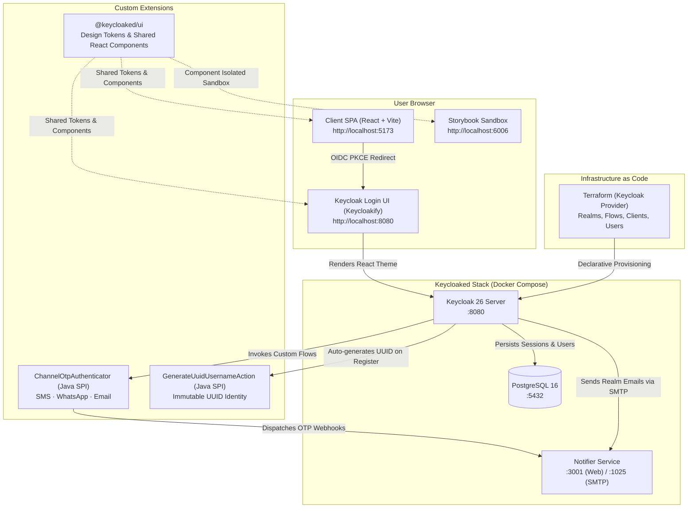

# Keycloaked

> **Uber-Style Unified Authentication Architecture (USL) for Keycloak 26**  
> Passwordless-first, multi-channel OTP (SMS, WhatsApp, Email), Passkeys (WebAuthn), immutable UUID identity, in-app Sudo Mode, and a pixel-perfect shared React design system.

[](https://www.keycloak.org/)
[](https://react.dev/)
[](https://docs.keycloakify.dev/)
[](https://www.terraform.io/)
[](https://opensource.org/licenses/MIT)

---

## Table of Contents

- [Overview & Architecture](#overview--architecture)
- [Industry Benchmark & Comparison](docs/BENCHMARK_COMPARISON.md)
- [Quick Reference: URLs & Credentials](#quick-reference-urls--credentials)
- [Prerequisites](#prerequisites)
- [Quick Start Guide](#quick-start-guide)
- [Components Involved & Directory Structure](#components-involved--directory-structure)
- [Custom Keycloak SPIs](#custom-keycloak-spis)
- [Authentication Factor Hierarchy](#authentication-factor-hierarchy)
- [Sudo Mode & Security Workflows](#sudo-mode--security-workflows)
- [Features Covered](#features-covered)
- [Specifications & Standards Compliancy](#specifications--standards-compliancy)
- [Documentation & External References](#documentation--external-references)
- [All Make Commands Reference](#all-make-commands-reference)

---

## Overview & Architecture

**Keycloaked** is an open-source reference architecture that brings consumer-grade authentication—inspired by Uber's Unified Signup and Login (USL)—to **Keycloak 26**. It combines modern passwordless identity, biometric passkeys, dynamic multi-channel OTP routing, zero-username registration, and a unified React design system shared between your client application and Keycloak's login pages.

> 📊 **In-Depth Benchmark Analysis**: Read our comprehensive [Industry Benchmark & Architectural Comparison](docs/BENCHMARK_COMPARISON.md) evaluating Keycloaked against **Uber (USL)**, **Google Identity**, **GitHub**, **Shopify (Shop Pay)**, **WhatsApp / Meta**, **Apple ID**, **Revolut**, **Stripe**, and **PayPal**.

### System Architecture Diagram



---

## Quick Reference: URLs & Credentials

### Services & Endpoints

| Service | URL | Default Credentials / Purpose |
|---|---|---|
| **Client Application (SPA)** | [http://localhost:5173](http://localhost:5173) | Main user demo app with Account & Security Center |
| **Keycloak Admin Console** | [http://localhost:8080/admin](http://localhost:8080/admin) | `admin` / `admin` (master realm) |
| **Playground Realm Endpoint** | [http://localhost:8080/realms/playground](http://localhost:8080/realms/playground) | OIDC discovery: `.../.well-known/openid-configuration` |
| **Keycloak Account Console** | [http://localhost:8080/realms/playground/account](http://localhost:8080/realms/playground/account) | Built-in Keycloak account management UI |
| **Notifier Live Dashboard** | [http://localhost:3001](http://localhost:3001) | Live visual feed of sent SMS, WhatsApp, and Email OTPs |
| **Notifier SMTP (MailHog)** | `localhost:1025` | SMTP port capturing outgoing realm notification emails |
| **Storybook (Theme UI)** | [http://localhost:6006](http://localhost:6006) | Component sandbox for login/register pages without Keycloak |
| **PostgreSQL Database** | `localhost:5432` | `keycloak` / `keycloak` (Database: `keycloak`) |

### Pre-Configured Playground Test Account

| Field | Value | Notes |
|---|---|---|
| **Email** | `testuser@example.com` | Primary contact and login factor |
| **Phone Number** | `+31 6 0000 0000` | Stored as E.164 `+31600000000` (Dutch unallocated test range) |
| **Password (Fallback)** | `password123` | Active when using password fallback ("Try another way") |
| **Company UUID** | `4f8eee18-19bd-479a-ac9d-0e25ba3a2ce6` | Generated UUID mapped to `preferred_username` claim |
| **Assigned Roles** | `user`, `manage-account` | Granted in `playground` realm |

---

## Prerequisites

Ensure you have the following installed on your host system:

- **[Docker & Docker Compose](https://docs.docker.com/get-docker/)**: For running Keycloak, PostgreSQL, and Notifier.
- **[GNU Make](https://www.gnu.org/software/make/)**: Life-cycle command runner.
- **[Node.js](https://nodejs.org/) v20+** or **v24 LTS**: Package manager: `yarn` (v1.22+).
- **[Apache Maven](https://maven.apache.org/)**: Required to build the custom Java SPIs (`mvn`).
- **[Terraform](https://www.terraform.io/)**: Version v1.5+ (managed via `tfenv` or binary install).

---

## Quick Start Guide

Follow these 4 simple steps to get the complete stack up and running:

### Step 1: Start Container Services
Launches PostgreSQL 16, Keycloak 26, and the Notifier proxy in the background:
```bash
make up
```
> Keycloak takes ~15–20 seconds to boot on first start. Verify status with `make status`.

### Step 2: Provision Realm with Terraform
Initializes and applies Terraform, creating the `playground` realm, clients, roles, USL browser flow, and the test account:
```bash
make realm-provision
```

### Step 3: Start the Client Application
Installs dependencies (if not already installed) and starts the Vite development server:
```bash
make app-dev
```
Open **[http://localhost:5173](http://localhost:5173)** in your browser:
- Click **"Continue to Keycloaked ➔"** to trigger the unified sign-in flow.
- Enter `testuser@example.com` or `+31 6 0000 0000`.
- Verify using the 6-digit OTP captured live in the dashboard at **[http://localhost:3001](http://localhost:3001)**.

### Step 4: (Optional) Explore Theme in Storybook
Inspect and develop login, OTP, registration, and error pages in isolation with mock user sessions:
```bash
make theme-storybook
```
Opens Storybook at **[http://localhost:6006](http://localhost:6006)**.

---

## Components Involved & Directory Structure

```
keycloaked/
├── app/                      # Client Single Page Application (React + Vite)
│   ├── src/
│   │   ├── App.tsx           # Main application view, Hero, Profile Card, & Token Inspector
│   │   ├── keycloak.ts       # keycloak-js client instance with PKCE & silent refresh
│   │   └── index.css         # Client styling consuming @keycloaked/ui tokens
│   └── package.json
│
├── packages/ui/              # Shared Design System (@keycloaked/ui)
│   ├── src/
│   │   ├── components/       # Button, Input, Badge, Card, Alert, SudoModeModal,
│   │   │                     # AccountSecurityCard, FactorVerificationModal, Logo
│   │   ├── tokens.css        # Design tokens (--keycloaked-*) for light & dark modes
│   │   └── workflow/         # TypeScript types & client parser for usl-workflow.yaml
│   └── package.json
│
├── theme/                    # Keycloakify React Theme for Keycloak 26
│   ├── src/login/
│   │   ├── pages/            # Login, LoginUsername, LoginOtp, LoginPassword,
│   │   │                     # LoginConfigTotp, Register, WebauthnAuthenticate
│   │   └── Template.tsx      # Unified responsive layout card, header, and footer
│   ├── .storybook/           # Storybook configuration and stories for every page
│   └── dist_keycloak/        # Output directory mounted directly into Keycloak container
│
├── providers/channel-otp/    # Custom Keycloak Java SPIs (Maven project)
│   ├── src/main/java/com/keycloaked/keycloak/
│   │   ├── authenticator/otp/           # ChannelOtpAuthenticator & factory classes
│   │   └── authenticator/registration/  # GenerateUuidUsernameAction registration SPI
│   └── pom.xml
│
├── services/notifier/        # Lightweight Notification Backend & Webhook Proxy
│   ├── server.js             # HTTP API (port 3001) + SMTP server (port 1025)
│   └── README.md
│
├── terraform/                # Infrastructure as Code (mrparkers/keycloak provider)
│   ├── realm_playground.tf   # Realm configuration, theme binding, SMTP setup
│   ├── flow_usl_browser.tf   # Uber USL browser authentication execution flow
│   ├── flow_sudo_direct_grant.tf # Dedicated step-up direct grant flow
│   ├── client_playground_app.tf  # OIDC client credentials & redirect URIs
│   ├── users.tf              # Test user & role assignments
│   └── main.tf
│
├── docker-compose.yml        # Multi-container stack (Postgres, Keycloak, Notifier)
├── Makefile                  # Lifecycle orchestration targets
└── usl-workflow.yaml         # Declarative USL policy specification
```

### Component Deep-Dive

1. **Client Application (`app/`)**: A React 18 + Vite SPA demonstrating complete OIDC integration using `keycloak-js`. It includes an Account Security Center where authenticated users can reorder OTP channel priorities, link/unlink WhatsApp, register Passkeys, and trigger Sudo Mode step-up re-authentication.
2. **Shared UI Library (`packages/ui/`)**: Houses `@keycloaked/ui`. Both the client SPA and the Keycloak login theme consume the exact same CSS design tokens, typography, and React components, ensuring 100% visual parity across host domains.
3. **Keycloakify Theme (`theme/`)**: Uses [Keycloakify](https://docs.keycloakify.dev/) to render Keycloak's FreeMarker templates as modern React components. Includes full Storybook coverage for rapid frontend development without needing a running Keycloak instance.
4. **Custom Java SPIs (`providers/channel-otp/`)**: Native Keycloak extensions compiled into a single JAR file and mounted into `/opt/keycloak/providers/`.
5. **Notifier Service (`services/notifier/`)**: A lightweight Node.js service that simulates an SMS/WhatsApp gateway and provides an embedded SMTP server (using nodemailer & smtp-server), exposing a real-time web dashboard on port 3001.
6. **Terraform Configurations (`terraform/`)**: Fully defines the `playground` realm declaratively. Managing authentication flows via Terraform ensures repeatable, version-controlled deployments.

---

## Custom Keycloak SPIs

Keycloaked extends Keycloak with two custom Service Provider Interfaces (SPIs):

### 1. Multi-Channel OTP Authenticator (`ChannelOtpAuthenticator`)
- **Provider ID**: `channel-otp`
- **Purpose**: A single authenticator that dynamically routes one-time passcodes across **SMS**, **WhatsApp**, and **Email**.
- **Mechanics & Security Guarantees**:
  - **Dynamic Factor Discovery**: Inspects user attributes (`phone_number`, `whatsapp_linked`, `email`) and selects the initial channel based on user preference (`preferred_otp_channel`).
  - **Live Channel Switching**: Users can switch channels on the fly (e.g. click *"Send via WhatsApp to +316 ••••• 0000"*).
  - **Single-Use Replay Protection**: Generated codes are stored inside the transient `AuthenticationSessionModel` and invalidated immediately upon successful verification.
  - **Auto-Revocation**: Requesting a resend or switching channels immediately generates a new code and revokes the previous code, preventing multi-code exploitation.
  - **Session Cooldown**: Enforces a 30-second wait between code generation requests to prevent flooding and abuse.

### 2. UUID Username Action (`GenerateUuidUsernameAction`)
- **Provider ID**: `generate-uuid-username-action`
- **Purpose**: Eliminates user-facing usernames entirely while fulfilling Keycloak's internal username requirements.
- **Mechanics**:
  - **Pre-Creation Interception (`validate`)**: Intercepts registration submissions. When `username` is absent, it automatically injects a cryptographically secure UUID (`UUID.randomUUID().toString()`).
  - **Post-Creation Persistence (`success`)**: Maps the UUID into the `preferred_username` claim.
  - **Immutability Enforcement**: The realm setting `edit_username_allowed = false` ensures that once assigned, the identifier cannot be modified by the user.

---

## Authentication Factor Hierarchy

Keycloaked organizes authentication into a clear, intuitive top-to-bottom priority list:

```
┌────────────────────────────────────────────────────────┐
│  🔒 FIXED HIGH-SECURITY TIER (Evaluated First)         │
│  Rank #1: Passkeys & Biometrics (WebAuthn / FIDO2)     │
│  Rank #2: Authenticator App (TOTP - RFC 6238)          │
├────────────────────────────────────────────────────────┤
│  ⚡ CONFIGURABLE OTP CHANNELS TIER                     │
│  Rank #3: Primary Channel  [SMS / WhatsApp / Email]   │
│  Rank #4: Backup Channel   [Alternative OTP channel]   │
│  (Users click "Make Primary" / "Make Backup" to swap)  │
├────────────────────────────────────────────────────────┤
│  🛡️ OPTIONAL FALLBACK TIER                             │
│  Rank #5: Password Fallback ("Try another way")        │
└────────────────────────────────────────────────────────┘
```

- **Passkeys (Rank #1)**: Evaluated first. If the user's device supports WebAuthn and a passkey is registered, the browser triggers conditional autofill or prompt.
- **Authenticator App (Rank #2)**: If configured, TOTP apps (Google Authenticator, 1Password) take precedence over SMS/WhatsApp for enhanced resistance to SIM swapping.
- **Configurable OTP Channels (Ranks #3 & #4)**: Users can set their preference between SMS, WhatsApp, and Email. Swapping them in the client SPA updates the `preferred_otp_channel` attribute immediately.
- **Single Verified Phone Number**: Users verify their phone number once. WhatsApp can then be toggled on/off using the same verified number without duplicate SMS verification.
- **Password Fallback (Rank #5)**: Available via "Try another way" if the user cannot access their OTP or biometrics.

---

## Sudo Mode & Security Workflows

To prevent unauthorized account takeovers if a device is left unattended, Keycloaked implements **Sudo Mode** (Step-Up Re-Authentication):

1. **Trigger**: Initiating any sensitive operation—such as adding/updating a phone number, changing email, updating password, or unlinking an active factor.
2. **Challenge Modal**: Displays a step-up verification modal requiring the user to re-verify using their strongest configured factor.
3. **Dedicated Direct Grant Flow**: Handled through a dedicated Keycloak direct-grant execution flow (`flow_sudo_direct_grant.tf`), completely separate from the browser session cookies.
4. **Elevation Window**: Upon successful verification, an elevated 15-minute clearance token is issued, allowing modifications before locking again.

---

## Features Covered

- [x] **Unified Identifier-First Login (USL)**: A single input for Email or Phone. The system detects whether an account exists and prompts for sign-in or registration seamlessly.
- [x] **Passwordless-First Architecture**: OTP and Biometrics are primary; password is an optional fallback.
- [x] **Zero Usernames**: Seamless registration without needing or displaying arbitrary usernames.
- [x] **WebAuthn / Passkeys**: Native biometrics (Face ID, Touch ID, Windows Hello) with Conditional UI autofill.
- [x] **Multi-Channel OTP**: SMS, WhatsApp, and Email with on-the-fly channel switching.
- [x] **Rate Limiting & Cooldown**: Built-in 30-second cooldown per session and single-use replay protection.
- [x] **Account Security Center**: User-facing dashboard to manage factors, promote backup channels to primary, and view linked devices.
- [x] **In-App Sudo Mode**: Step-up re-authentication protecting sensitive account modifications.
- [x] **Shared Design System**: Single source of truth for styles (`tokens.css`) and components (`@keycloaked/ui`).
- [x] **Storybook Component Sandbox**: Interactive development of Keycloak themes with mock user states.
- [x] **Mock Notifier & SMTP Dashboard**: Built-in visual logger for outbound OTPs and emails.
- [x] **Infrastructure as Code**: 100% declarative realm, client, and flow configuration via Terraform.

---

## Specifications & Standards Compliancy

| Standard / Specification | Implementation Details |
|---|---|
| **OpenID Connect Core 1.0** | Authorization Code Flow with PKCE (RFC 7636); standard claims (`sub`, `email`, `preferred_username`). |
| **OAuth 2.0 (RFC 6749)** | Bearer token authorization, refresh token rotation, token revocation. |
| **Proof Key for Code Exchange (RFC 7636)** | Required for all public SPA client authentication. |
| **WebAuthn / FIDO2 Level 2 & 3** | Public key credentials, user verification, and WebAuthn Conditional UI. |
| **RFC 6238 (TOTP)** | Time-based one-time passwords with configurable drift windows and HMAC-SHA1/SHA256 support. |
| **ITU-T E.164** | International telephone numbering validation and storage format (`+<country_code><number>`). |
| **Keycloak Declarative User Profile** | Strict attribute permissions (`username` viewable by user, editable only by admin). |

---

## Documentation & External References

### Project Documentation
- **[Industry Benchmark & Architectural Comparison](docs/BENCHMARK_COMPARISON.md)**: Comprehensive evaluation, company case studies (Uber, Google, GitHub, Shopify, WhatsApp, Apple, Airbnb), gap analysis, and flow judgment.

### Framework & Specification References
- **Keycloak Official Guides**: [https://www.keycloak.org/guides](https://www.keycloak.org/guides)
- **Keycloak Server Developer Guide (SPIs)**: [https://www.keycloak.org/docs/latest/server_development/](https://www.keycloak.org/docs/latest/server_development/)
- **Keycloakify Documentation**: [https://docs.keycloakify.dev/](https://docs.keycloakify.dev/)
- **W3C WebAuthn Specification**: [https://www.w3.org/TR/webauthn-2/](https://www.w3.org/TR/webauthn-2/)
- **Terraform Keycloak Provider**: [https://registry.terraform.io/providers/mrparkers/keycloak/latest/docs](https://registry.terraform.io/providers/mrparkers/keycloak/latest/docs)
- **OAuth 2.0 Threat Model and Security Considerations (RFC 6819)**: [https://datatracker.ietf.org/doc/html/rfc6819](https://datatracker.ietf.org/doc/html/rfc6819)

---

## All Make Commands Reference

Run `make help` to display all commands directly in your terminal:

### Container Management
| Command | Description |
|---|---|
| `make` / `make up` | Start PostgreSQL, Keycloak, and Notifier containers in background |
| `make down` | Stop all running containers |
| `make restart` | Restart all containers |
| `make logs` | Stream logs from all running containers |
| `make status` / `make ps` | Display container health and port mappings |
| `make clean` | Stop containers and wipe persistent database volumes (`docker compose down -v`) |

### Standalone Application (`app/`)
| Command | Description |
|---|---|
| `make app-install` | Install dependencies in `app/` via Yarn |
| `make app-dev` | Start the client SPA on [http://localhost:5173](http://localhost:5173) |
| `make app-build` | Run TypeScript check and build production Vite bundle |

### Keycloakify Theme (`theme/`)
| Command | Description |
|---|---|
| `make theme-storybook` | Launch Storybook on [http://localhost:6006](http://localhost:6006) for page development |
| `make theme-dev` | Start the local Vite development server for the theme |
| `make theme-build` | Package the React theme into a Keycloak JAR distribution |
| `make theme-deploy` | Build the theme JAR and immediately restart Keycloak to apply changes |
| `make theme-install` | Install dependencies in `theme/` via Yarn |

### Custom Java SPIs (`providers/`)
| Command | Description |
|---|---|
| `make provider-build` | Compile Channel OTP Java SPI using Maven and copy JAR to `theme/dist_keycloak/` |
| `make provider-deploy` | Compile SPI JAR and restart Keycloak to reload the provider classes |

### Terraform Realm Provisioning (`terraform/`)
| Command | Description |
|---|---|
| `make realm-provision` | Run `terraform init` and `terraform apply` to provision the playground realm |
| `make realm-destroy` | Tear down all Terraform-managed Keycloak realm infrastructure |
| `make tf-plan` | Preview Terraform changes against the live Keycloak instance |
| `make tf-output` | Display client IDs, realm endpoints, and credentials |
| `make tf-apply` | Apply Terraform configuration with auto-approval |

### Notifier Service (`services/notifier/`)
| Command | Description |
|---|---|
| `make notifier-logs` | Follow live container logs from the SMS/WhatsApp/SMTP notifier proxy |
| `make notifier-dev` | Run the notifier directly on the host machine (`node services/notifier/server.js`) |

---

## License

Distributed under the MIT License. See `LICENSE` for more information.
