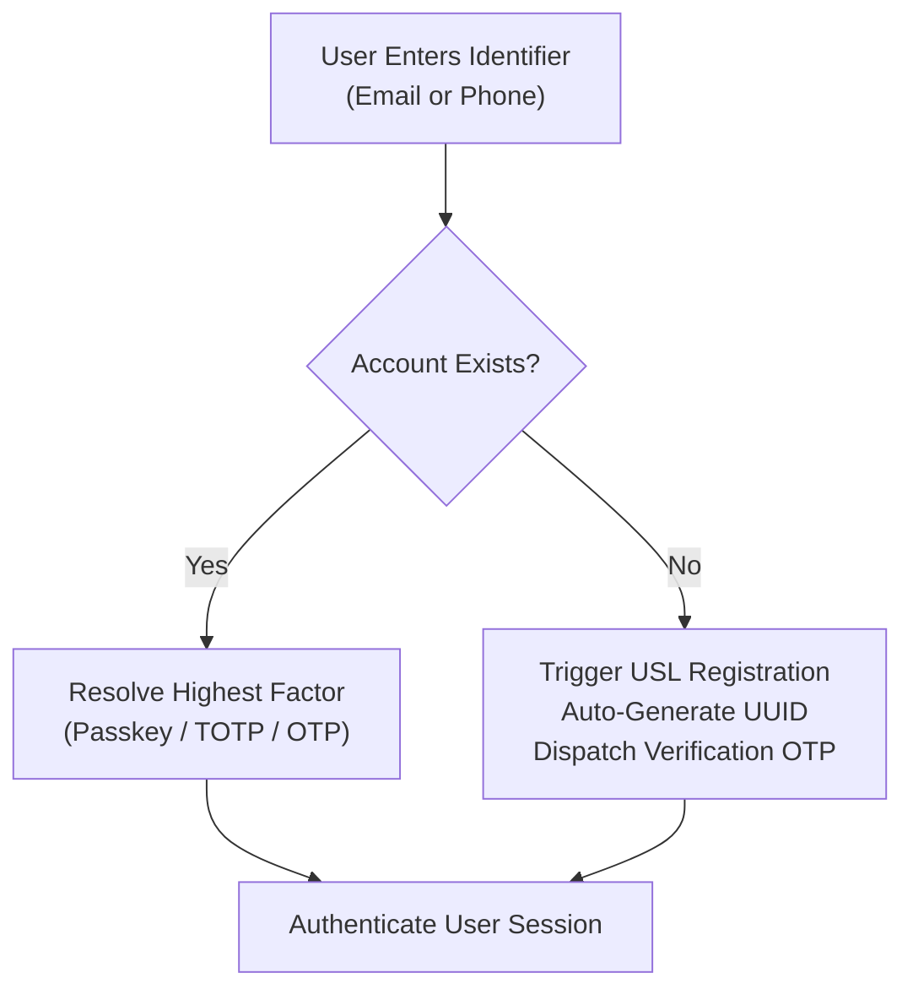
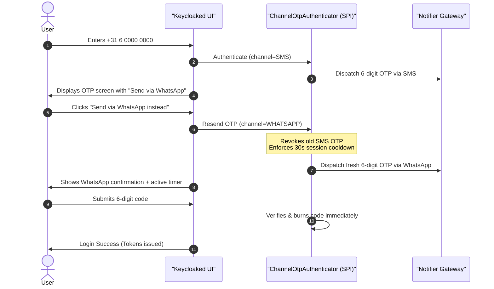
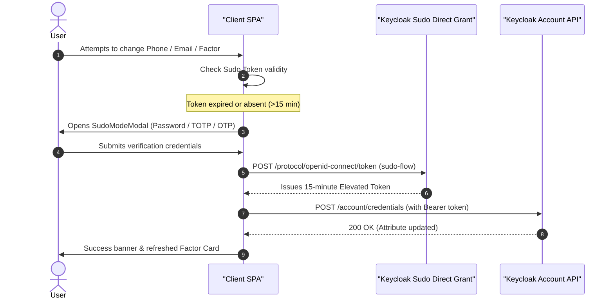
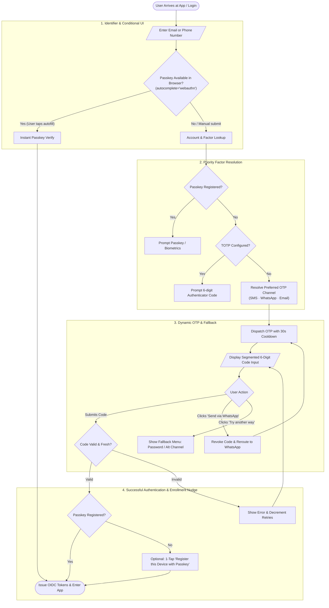

# Industry Authentication Benchmark & Comparative Architecture Analysis

> **Evaluating Keycloaked against Consumer & Enterprise Identity Leaders**  
> Comprehensive technical comparison of Keycloaked against Uber (USL), Google Identity, GitHub, Shopify (Shop Pay), WhatsApp/Meta, Apple ID, and Airbnb.

---

## Table of Contents

- [Executive Summary & Competitive Matrix](#executive-summary--competitive-matrix)
- [Company Case Studies & Architectural Analysis](#company-case-studies--architectural-analysis)
  - [1. Uber (Unified Signup and Login — USL)](#1-uber-unified-signup-and-login--usl)
  - [2. Google Identity](#2-google-identity)
  - [3. GitHub](#3-github)
  - [4. Shopify / Shop Pay](#4-shopify--shop-pay)
  - [5. WhatsApp & Meta](#5-whatsapp--meta)
  - [6. Apple ID](#6-apple-id)
  - [7. Airbnb](#7-airbnb)
- [Mobile Frontend Implementation Deep-Dive (Native vs. React Native vs. WebViews)](#mobile-frontend-implementation-deep-dive-native-vs-react-native-vs-webviews)
  - [The Four Mobile Frontend Paradigms](#the-four-mobile-frontend-paradigms)
  - [Architectural Trade-Off Matrix](#architectural-trade-off-matrix)
  - [RFC 8252 (OAuth 2.0 for Native Apps) and the Anti-WebView Consensus](#rfc-8252-oauth-20-for-native-apps-and-the-anti-webview-consensus)
- [Detailed Benchmark by Feature Dimension](#detailed-benchmark-by-feature-dimension)
  - [1. Unified Identifier-First Experience (USL)](#1-unified-identifier-first-experience-usl)
  - [2. Multi-Channel OTP (SMS, WhatsApp, Email)](#2-multi-channel-otp-sms-whatsapp-email)
  - [3. Zero Usernames & UUID Identity](#3-zero-usernames--uuid-identity)
  - [4. Step-Up Re-Authentication (In-App Sudo Mode)](#4-step-up-re-authentication-in-app-sudo-mode)
  - [5. Rate Limiting, Cooldown & Replay Protection](#5-rate-limiting-cooldown--replay-protection)
- [Gap Analysis: Where Keycloaked Leads vs. Opportunities for Improvement](#gap-analysis-where-keycloaked-leads-vs-opportunities-for-improvement)
- [Architectural Judgment: How Our Flow Should Be](#architectural-judgment-how-our-flow-should-be)
  - [Recommended Flow Sequence](#recommended-flow-sequence)
  - [Recommended Mobile Frontend Strategy for Keycloaked](#recommended-mobile-frontend-strategy-for-keycloaked)
- [Conclusion & Actionable Roadmap](#conclusion--actionable-roadmap)

---

## Executive Summary & Competitive Matrix

Modern consumer authentication has evolved away from disjointed "Sign In" vs. "Sign Up" screens, vulnerable shared passwords, and user-facing usernames. High-velocity consumer platforms (Uber, Shopify, WhatsApp) and developer/enterprise security pioneers (Google, GitHub, Apple) have established specialized design patterns for frictionless yet resilient identity.

**Keycloaked** combines consumer-grade Unified Signup and Login (USL) with enterprise OIDC identity standards using **Keycloak 26**. Below is an architectural capability comparison across key identity dimensions, including frontend mobile rendering technologies:

| Dimension / Feature | Keycloaked | Uber (USL) | Google Identity | GitHub | Shopify (Shop Pay) | WhatsApp / Meta | Apple ID | Airbnb |
|---|:---:|:---:|:---:|:---:|:---:|:---:|:---:|:---:|
| **Mobile Frontend Architecture** | **System Browser (AppAuth) / Direct API** | **100% Native (RIBs + SDUI)** | **100% Native (OS Credential Mgr)** | **100% Native App / System Browser** | **React Native + Native Biometrics** | **100% Native (C++ / Swift / Kotlin)** | **100% Native (OS System Daemons)** | **100% Native (Swift/Kotlin + SDUI)** |
| **Mobile Rendering Tech** | React 18 / Custom Native | Swift (iOS), Kotlin (Android) | Java/Kotlin Play Services | SwiftUI / Jetpack Compose | React Native (Shop App) | UIKit / Jetpack Compose | CoreAnimation / AppKit | Swift / Kotlin Native UI |
| **Unified Identifier-First (USL)** | ✅ Full | ✅ Full (Pioneer) | ✅ Full | ⚠️ Separate screens | ✅ Full | ✅ Full (Phone-only) | ⚠️ Separate modal | ✅ Full |
| **Zero Usernames (UUID Identity)** | ✅ Auto UUID | ✅ Internal UUID | ❌ User-facing | ❌ User-facing | ✅ Internal ID | ✅ Phone number | ✅ Apple ID / Email | ✅ Internal ID |
| **Multi-Channel OTP Routing** | ✅ SMS, WA, Email | ✅ SMS, WA, Email | ❌ SMS, Voice | ❌ SMS, TOTP | ❌ SMS, Email | ❌ SMS, WA | ❌ SMS, Push | ⚠️ SMS, WA (Select markets) |
| **Live Factor / Channel Switching** | ✅ In-session switch | ✅ In-session switch | ⚠️ "Try another way" | ⚠️ Fallback modal | ⚠️ Email fallback | ❌ Rigid retry | ⚠️ Device / SMS | ⚠️ Fallback modal |
| **WebAuthn / Passkeys** | ✅ Full + Cond. UI | ✅ Native + WebAuthn | ✅ Default Factor | ✅ Autofill + Security | ⚠️ In app/biometric | ✅ Passkeys in app | ✅ Platform Default | ⚠️ Biometrics in app |
| **In-App Sudo Mode (Step-Up)** | ✅ Dedicated Direct Grant | ⚠️ Re-auth on card edit | ✅ Critical Action Check | ✅ 2-hr Sudo Window | ❌ Direct checkout | ❌ Biometric lock only | ✅ Device Passcode | ⚠️ High-trust action check |
| **Single-Use Replay & Cooldown** | ✅ Session burn + 30s | ✅ Strict cooldown | ✅ Dynamic backoff | ✅ Cooldown | ✅ 60s cooldown | ✅ Progressive backoff | ✅ Rate limited | ✅ Rate limited |
| **Shared Design System with IdP** | ✅ @keycloaked/ui (1:1) | ✅ Base Web Design | ⚠️ Material 3 | ⚠️ Primer | ⚠️ Polaris | ❌ Native only | ❌ Human Interface | ⚠️ DLS (Design Lang Sys) |
| **Self-Hosted & Open Source** | ✅ MIT (Keycloak 26) | ❌ Proprietary | ❌ Proprietary | ❌ Proprietary | ❌ Proprietary | ❌ Proprietary | ❌ Proprietary | ❌ Proprietary |

---

## Company Case Studies & Architectural Analysis

### 1. Uber (Unified Signup and Login — USL)
*The Primary Architectural Inspiration for Keycloaked*

#### How Uber Does It:
- **Unified Entry (`/login` & `/signup` merged)**: Uber completely eliminated the cognitive load of choosing between login and registration. Users enter their mobile number or email in a single input field.
- **Microservice Orchestration**: Uber’s USL routes the identifier to an internal account detection service. If the identifier exists, it triggers authentication; if not, it gathers lightweight profile details (name, terms acceptance) and creates the user seamlessly.
- **WhatsApp Integration**: In high-traffic international markets (India, Brazil, Mexico, Egypt, Southeast Asia), SMS delivery rates are inconsistent and expensive. Uber deployed WhatsApp Business API as a primary/secondary OTP channel, observing an 18-25% increase in conversion and OTP delivery rates.
- **Fallback Hierarchy**: The primary factor is either WhatsApp or SMS OTP. Users can click "Having trouble?" to route to Email OTP or password fallback.

#### Mobile Frontend Implementation (100% Native):
- **Tech Stack**: 100% Pure Native using Uber's open-source **RIBs (Router, Interactor, Builder)** architecture, written in Swift on iOS and Kotlin/Java on Android.
- **Server-Driven UI (SDUI)**: While the workflow logic is driven dynamically by backend JSON payloads, every visual element (inputs, buttons, bottom sheets) is rendered by pure native UI components (UIKit/SwiftUI and Android Views/Jetpack Compose).
- **Why Zero WebViews**: Uber strictly avoided embedded WebViews (`WKWebView`/`WebView`) because:
  1. *Conversion Friction*: WebViews introduce noticeable cold-boot latency and keyboard transition stutters.
  2. *OS Integration*: Pure native inputs integrate seamlessly with iOS `UITextContentType.oneTimeCode` and the Android SMS Retriever API to autofill SMS codes without user intervention.
  3. *Passkey Access*: Native APIs (`ASAuthorizationController` on iOS and Android `CredentialManager`) can be invoked directly from the native view hierarchy.

#### What Keycloaked Does Like Uber:
- Identical single identifier input supporting both phone numbers and emails.
- Dynamic fallback switcher allowing instant transition between SMS, WhatsApp, and Email.
- Real-time phone number formatting and unallocated test number compatibility.

#### Where Keycloaked Can Improve vs. Uber:
- **Silent Network Auth (Carrier Cellular Billing/SIM verify)**: In select countries, Uber authenticates mobile devices silently over mobile cellular data headers (RFC 9110 / GSMA Mobile Connect) without prompting for an OTP code.
- **Progressive Profiling**: Uber collects payment details or rider profiles incrementally after initial authentication rather than during registration.

---

### 2. Google Identity
*The Gold Standard in Passkey-First Identity & Risk Engines*

#### How Google Does It:
- **Passkeys as Default**: Google prompts for a Passkey immediately upon identifier resolution if a registered FIDO2 credential exists on the device or in Google Password Manager / iCloud Keychain.
- **Conditional UI Autofill**: Google utilizes `autocomplete="webauthn"` on the identifier input, letting users tap a saved passkey before even finishing typing their email.
- **Account Recovery Hierarchy**: Users register secondary recovery emails and phone numbers. If a device is untrusted, Google prompts for on-device "Google Prompts" (push notifications via Google Play Services / YouTube app) before falling back to TOTP or SMS.
- **Risk-Based Step-Up**: High-risk logins (new IP, unusual ASN, unusual time) trigger step-up challenges even if the primary factor succeeded.

#### Mobile Frontend Implementation (100% Native OS-Level):
- **Android**: 100% Native OS level. Authentication dialogs are rendered out-of-process by **Google Play Services** and the **Android Credential Manager** (`androidx.credentials`). The host app never sees or handles the credentials directly.
- **iOS**: Uses the native `GoogleSignIn-iOS` SDK (Swift/Objective-C), which utilizes `ASWebAuthenticationSession` (the secure Apple system browser sheet) for OAuth web redirection, while internal Google apps use native accounts managed via the shared iOS Keychain.
- **Anti-WebView Policy**: Google actively blocks OAuth requests initiated from embedded WebViews (`disallowed_useragent`), enforcing the use of system browsers or native Credential Manager.

#### What Keycloaked Does Like Google:
- Implements WebAuthn Conditional UI on login forms (`autocomplete="webauthn"`).
- Strictly enforces factor hierarchy (Passkey #1 -> TOTP #2 -> OTP Channels #3 -> Password #4).

#### Where Keycloaked Can Improve vs. Google:
- **Device & Risk Fingerprinting**: Keycloak 26 supports Contextual Authentication via plugins, but Keycloaked currently evaluates factors deterministically rather than calculating risk scores.
- **Push Notification Verification (Out-of-Band)**: Google Prompt push notifications avoid SMS interception risks.

---

### 3. GitHub
*The Benchmark for Developer Sudo Mode & WebAuthn*

#### How GitHub Does It:
- **Sudo Mode Security Window**: When performing sensitive operations (changing SSH keys, modifying billing, deleting a repository, generating PATs), GitHub checks if the user has authenticated within the last 2 hours. If not, a `sudo_mode` modal prompts for password, passkey, or TOTP.
- **Passkey-First Transformation**: GitHub upgraded from password-first to passkey-first authentication, allowing users to completely bypass passwords.
- **Username as Namespace**: Unlike consumer apps, GitHub treats usernames as a public namespace (`github.com/:username/:repo`), making usernames mandatory and public.

#### Mobile Frontend Implementation (Native App + System WebViews):
- **GitHub Mobile App**: Built with **100% Native** code (Swift/SwiftUI on iOS, Kotlin/Jetpack Compose on Android). Uses native biometrics (Face ID/Touch ID/Fingerprint) and native passkey APIs (`ASAuthorizationPlatformPublicKeyCredentialProvider`).
- **Third-Party Integrations & CLI**: Complies strictly with RFC 8252. When authenticating 3rd-party apps, GitHub launches `ASWebAuthenticationSession` (iOS) or Chrome Custom Tabs (Android) rather than embedded WebViews.

#### What Keycloaked Does Like GitHub:
- **In-App Sudo Mode**: Keycloaked implements step-up re-authentication protecting factor management, email changes, and phone number changes.
- **Isolated Authentication Flow**: Keycloaked executes Sudo Mode via a dedicated direct grant flow (`flow_sudo_direct_grant.tf`), ensuring that the user’s main browser SSO session is never invalidated or corrupted if re-authentication fails.

#### Where Keycloaked Can Improve vs. GitHub:
- **Session Duration Policy**: Keycloaked sets a fixed 15-minute Sudo window; GitHub allows session configurations and displays countdown indicators or prompts contextual to specific API actions.

---

### 4. Shopify / Shop Pay
*The Benchmark for 1-Click Consumer Checkout Identity*

#### How Shopify Does It:
- **Phone Number as Global Identity**: Shop Pay stores billions of consumer payment profiles keyed primarily to mobile phone numbers.
- **Frictionless 6-Digit SMS/Email OTP**: Once an email or phone is recognized, a 6-digit code is dispatched with native WebOTP autofill (`autocomplete="one-time-code"`).
- **Cross-Merchant Identity Federation**: A single Shop Pay login authenticates the user across millions of independent Shopify storefronts without showing store-specific account forms.

#### Mobile Frontend Implementation (React Native + Native Bridges):
- **Shop Consumer Mobile App**: Built extensively with **React Native**. Shopify is one of the largest enterprise contributors to the React Native ecosystem. The mobile auth flow is rendered in React Native, interfacing with native modules via TurboModules / JSI for device biometrics (`BiometricPrompt` / `LocalAuthentication`) and Apple Pay/Google Pay integration.
- **Merchant Checkout in Third-Party Apps**: When Shop Pay is integrated into 3rd-party merchant mobile apps, it runs inside a hardened, isolated system browser sheet (`SFSafariViewController` / Chrome Custom Tabs) to ensure PCI-DSS compliance and cross-merchant cookie sharing.

#### What Keycloaked Does Like Shopify:
- Unified OTP verification experience with 6-digit segmented inputs and automatic form submission upon typing the 6th digit.
- Single phone verification enabling multiple downstream services.

#### Where Keycloaked Can Improve vs. Shopify:
- **WebOTP API Integration**: Integrating `navigator.credentials.get({ otp: { transport: ["sms"] } })` so Android mobile browsers auto-read SMS codes without user typing.

---

### 5. WhatsApp & Meta
*The Benchmark for Phone-First Architecture & Channel Resiliency*

#### How WhatsApp Does It:
- **Zero-Username / Phone-First**: The phone number is the sole unique identifier. There is no concept of a username or password.
- **Two-Step Verification (PIN)**: To mitigate SIM swapping, WhatsApp offers a 6-digit numeric PIN set by the user, prompted periodically or upon new device registration.
- **Companion Device Linking**: Uses QR codes (public/private key exchange over WebSockets) to link web/desktop sessions to the mobile device without sharing credentials.

#### Mobile Frontend Implementation (100% Pure Native):
- **Tech Stack**: 100% Pure Native C++ core engine combined with native platform UI (Objective-C/Swift on iOS, Java/Kotlin on Android).
- **Strictly No WebViews**: WhatsApp does not use WebViews or React Native for any part of its onboarding, SMS verification, or account setup. Everything is rendered using direct platform UI primitives for maximum memory efficiency and instant startup on low-end devices.
- **Passkey Integration**: Invokes Android Credential Manager and iOS AuthenticationServices directly from native code.

#### What Keycloaked Does Like WhatsApp:
- First-class phone number authentication and WhatsApp channel dispatch.
- Direct attribute isolation: phone numbers are normalized to ITU-T E.164 (`+31600000000`).

#### Where Keycloaked Can Improve vs. WhatsApp:
- **WhatsApp 1-Tap Login Buttons**: Utilizing WhatsApp Business interactive message templates featuring "Copy Code" or 1-tap deep links directly into the application.

---

### 6. Apple ID
*The Benchmark for Hardware-Bound Ecosystem Identity*

#### How Apple Does It:
- **Platform Authenticator Dominance**: Touch ID and Face ID act as the default gatekeepers.
- **Trusted Device 2FA**: Push-delivered 6-digit codes to active iOS/macOS devices with geographic location prompts.
- **Hide My Email**: Provides randomly generated forwarding relay emails (`@privaterelay.appleid.com`), keeping true user identifiers private.

#### Mobile Frontend Implementation (100% Native OS Daemons):
- **Implementation**: Completely native at the OS level. Dialogs are rendered out-of-process by system daemons (`authd`, SpringBoard) using private Apple frameworks.
- **Third-Party Apps**: Third-party apps access Apple ID via `AuthenticationServices.framework` (`ASAuthorizationAppleIDButton`), which displays a native system modal that the calling app cannot inspect or alter.

#### What Keycloaked Does Like Apple:
- Native WebAuthn integration works out-of-the-box with Touch ID and Apple Passkeys synchronized across iCloud Keychain.

#### Where Keycloaked Can Improve vs. Apple:
- **Private Relay / Email Aliasing**: Supporting user-generated anonymous aliases for privacy-conscious enterprise users.

---

### 7. Airbnb
*The Benchmark for Global Marketplace Identity*

#### How Airbnb Does It:
- **Omni-Channel Entry**: Offers Phone, Email, Google, Apple, and Facebook in a single card without separating login and signup.
- **Dynamic Factor Ingestion**: If a user enters a phone number, it triggers SMS OTP with a WhatsApp fallback option in emerging markets. If an email is entered, it prompts for password or magic link.
- **Trust & Verification (Identity Documents)**: Multi-tiered verification (government ID scan, selfie check) deferred until the user attempts a high-trust action (booking or hosting).

#### Mobile Frontend Implementation (100% Native + Server-Driven UI):
- **Migration History**: Airbnb famously pioneered React Native (2016–2018) across their mobile apps, but completely decommissioned it in 2018 in favor of **100% Native** codebases (Swift on iOS, Kotlin on Android).
- **Current Architecture**: Airbnb's authentication and onboarding are now 100% native views driven by Server-Driven UI (SDUI). This allows backend engineers to modify login steps and experiment with OTP channels dynamically while rendering 100% native platform widgets.

#### What Keycloaked Does Like Airbnb:
- Dynamic input detection adapting the subsequent screen based on whether an email or phone was entered.
- Seamless fallback mechanisms if a chosen channel fails.

#### Where Keycloaked Can Improve vs. Airbnb:
- **Social IdP Merging (Account Linking)**: Streamlined automatic linking when a user logs in with Google using an email that already matches an SMS-registered account.

---

## Mobile Frontend Implementation Deep-Dive (Native vs. React Native vs. WebViews)

### The Four Mobile Frontend Paradigms

When building mobile authentication frontends, identity architectures fall into one of four distinct patterns:

```
┌─────────────────────────────────────────────────────────────────────────────┐
│ 1. 100% Pure Native (Uber, WhatsApp, Airbnb, Apple ID)                      │
│    Swift/SwiftUI + Kotlin/Compose. Maximum speed, direct biometric APIs,     │
│    zero web layer, full OS autofill. Requires maintaining two codebases.    │
├─────────────────────────────────────────────────────────────────────────────┤
│ 2. Cross-Platform Native Runtime (Shopify / Shop App)                       │
│    React Native / Flutter with native bridges. Single JS/Dart codebase,     │
│    renders native platform primitives. Fast, but requires bridge plugins    │
│    for WebAuthn/Passkeys and OS SMS Retriever.                              │
├─────────────────────────────────────────────────────────────────────────────┤
│ 3. Secure System Browser / AppAuth (GitHub 3rd-party, Keycloaked OIDC)      │
│    ASWebAuthenticationSession (iOS) & Chrome Custom Tabs (Android).          │
│    Recommended by RFC 8252. Shares system cookies/passkeys, instant updates  │
│    without App Store review, but introduces a visible browser modal sheet.  │
├─────────────────────────────────────────────────────────────────────────────┤
│ 4. Embedded WebViews (ANTI-PATTERN - Disallowed by Google/Apple)            │
│    WKWebView / Android WebView inside the app. Vulnerable to credential     │
│    interception, broken WebAuthn support, lacks shared system cookies.      │
└─────────────────────────────────────────────────────────────────────────────┘
```

### Architectural Trade-Off Matrix

| Metric | 100% Native (Uber, WhatsApp) | React Native (Shopify) | System Browser / AppAuth (Keycloaked) | Embedded WebView (Legacy) |
|---|:---:|:---:|:---:|:---:|
| **First-Frame Latency** | Instant (~10–30ms) | Fast (~50–100ms) | Moderate (~200–400ms modal open) | Slow (~400–1000ms DOM load) |
| **Passkey / WebAuthn** | Native `ASAuthorization` / `CredentialManager` | Native bridge required | Native browser WebAuthn | ❌ Broken / Not supported |
| **SMS Autofill** | Native SMS Retriever / OneTimeCode | Native module required | Partial (Safari/Chrome auto-detect) | ⚠️ Inconsistent |
| **Cross-App SSO Session** | ❌ App-isolated | ❌ App-isolated | ✅ Shared browser cookies | ❌ Isolated storage |
| **Instant UI Updates** | ❌ Requires App Store release (unless SDUI) | ⚠️ OTA updates (CodePush) | ✅ Instant IdP server deploy | ✅ Instant server deploy |
| **RFC 8252 Compliance** | ⚠️ N/A (1st-party only) | ⚠️ N/A (1st-party only) | ✅ 100% Compliant | ❌ Explicitly Violated |

### RFC 8252 (OAuth 2.0 for Native Apps) and the Anti-WebView Consensus

A crucial consideration for mobile identity is [RFC 8252 (OAuth 2.0 for Native Apps)](https://datatracker.ietf.org/doc/html/rfc8252):

1. **The Vulnerability of Embedded WebViews**:
   - In an embedded `WKWebView` or Android `WebView`, the host mobile application has complete access to the web context's DOM, JavaScript state, and keystrokes. A malicious or compromised app can inspect password fields, steal OTP codes, or hijack session cookies without the user's knowledge.
   - For this reason, both **Google** and **Apple** have formally banned OAuth logins inside embedded WebViews. Google throws a `403 disallowed_useragent` error if an OAuth flow is detected in a WebView.
2. **The System Browser Mandate**:
   - RFC 8252 mandates that OAuth flows in native apps must use the **external system browser** or secure system browser tabs:
     - **iOS**: `ASWebAuthenticationSession` (or `SFAuthenticationSession`).
     - **Android**: `Custom Tabs` (via Chrome, Firefox, etc.).
   - These components run in a separate process sandbox that the host application cannot inspect, while sharing the user's existing login sessions, saved passwords, and registered WebAuthn passkeys from Safari or Chrome.

---

## Detailed Benchmark by Feature Dimension

### 1. Unified Identifier-First Experience (USL)



- **Industry Standard**: Separate "Sign In" and "Sign Up" buttons cause user drop-off (users forget which provider or email they registered with). Uber, Google, and Shopify utilize identifier-first inputs.
- **Keycloaked Alignment**: Keycloaked implements an identifier-first design. The system evaluates whether the input is an E.164 phone number or email address, detects existing registrations, and resolves the next challenge automatically.
- **Security Assessment**: To prevent user enumeration via timing attacks, Keycloaked uses consistent execution paths and constant-time database lookups.

---

### 2. Multi-Channel OTP (SMS, WhatsApp, Email)



- **Channel Diversity**: SMS delivery fails in many developing countries due to telecom filtering, SS7 vulnerabilities, or carrier outages. Providing WhatsApp as an alternative channel increases delivery success to >98%.
- **Live Channel Switching**: Unlike standard Keycloak authenticators that force the user to restart the entire authentication flow, Keycloaked's `ChannelOtpAuthenticator` allows in-place channel switching without losing the active session.
- **Replay Protection & Auto-Revocation**: When a user switches channels or requests a new code, the previous code is immediately destroyed in `AuthenticationSessionModel`.

---

### 3. Zero Usernames & UUID Identity

- **The Problem with Usernames**: Traditional usernames suffer from collisions (`john_doe_99`), impersonation risks, and high registration friction.
- **Industry Trend**: Uber, Amazon, Apple, and Shopify have retired user-facing usernames entirely. Every customer is identified internally by an immutable UUID (v4) or opaque ID.
- **Keycloaked Implementation**: 
  - The `GenerateUuidUsernameAction` SPI intercepts Keycloak registration and generates a secure random UUID.
  - The UUID is mapped to the standard OIDC `preferred_username` claim for backward compatibility with downstream microservices.
  - Realm policy `edit_username_allowed = false` ensures immutability.

---

### 4. Step-Up Re-Authentication (In-App Sudo Mode)



- **GitHub Sudo Mode Model**: Requires re-authentication before sensitive mutations.
- **Keycloaked Implementation**: Instead of forcing a full browser redirect that interrupts the user's workflow, Keycloaked displays an in-app modal that executes a direct-grant flow. This issues a scoped short-lived clearance token without resetting or corrupting the main browser SSO session cookies.

---

### 5. Rate Limiting, Cooldown & Replay Protection

| Feature | Keycloaked Implementation | Industry Benchmark |
|---|---|---|
| **Resend Cooldown** | 30-second strict session countdown | 30s (Uber), 60s (Shopify, GitHub) |
| **Code Invalidation** | Active code revoked immediately upon resend or channel switch | Immediate revocation (Google, Uber) |
| **Replay Protection** | Code burned from session upon 1st verification | Single-use burn across all leaders |
| **Cross-Factor Isolation** | SMS code cannot be accepted on WhatsApp or Email form | Strict factor namespace isolation |

---

## Gap Analysis: Where Keycloaked Leads vs. Opportunities for Improvement

### Where Keycloaked Leads the Pack
1. **Self-Hosted Open Source Power**: Replicates proprietary enterprise authentication architectures (Uber USL, Google Passkeys, GitHub Sudo Mode) on a 100% open-source foundation (Keycloak 26, React, Vite, Terraform).
2. **True Design System Parity**: Keycloakify + `@keycloaked/ui` ensures the login screen, registration form, OTP prompt, and client application share exact CSS variables, buttons, fonts, and dark mode transitions.
3. **Dynamic Multi-Channel Architecture**: Few open-source solutions support on-the-fly switching between SMS, WhatsApp, and Email within a single authenticator SPI execution.
4. **Declarative Everything**: Complete realm provisioning, authentication execution flows, and client configurations are version-controlled in Terraform HCL.

### High-Priority Improvement Opportunities
1. **Adaptive & Risk-Based Authentication**:
   - *Current*: Deterministic factor evaluation based solely on user attributes.
   - *Proposed*: Integrate client device fingerprinting (browser canvas, IP geolocation, ASN velocity) to trigger step-up challenges only when anomalies are detected.
2. **WebOTP API & Mobile Auto-Fill**:
   - *Current*: Manual 6-digit input.
   - *Proposed*: Add `navigator.credentials.get({ otp: { transport: ["sms"] } })` to auto-read codes on mobile devices.
3. **WhatsApp Interactive Buttons**:
   - *Current*: Plaintext OTP sent via webhook.
   - *Proposed*: WhatsApp Cloud API Template Messages featuring a 1-tap "Copy Code" button.
4. **SIM-Swap & Carrier Lookup Validation**:
   - *Current*: Basic E.164 regex and Google libphonenumber formatting.
   - *Proposed*: Integrate carrier lookup APIs (Twilio Lookup / Telesign) to detect recent SIM swaps and route to email/passkey instead of SMS.
5. **Passkey Multi-Device Synchronization Badging**:
   - *Current*: Passkeys are listed as generic WebAuthn credentials.
   - *Proposed*: Inspect AAGUID to display brand icons (Apple iCloud Keychain, Google Password Manager, Windows Hello, YubiKey 5 NFC).

---

## Architectural Judgment: How Our Flow Should Be

Based on this industry benchmark, here is the architectural recommendation for the optimal authentication flow in Keycloaked:

### Recommended Flow Sequence



### Recommended Mobile Frontend Strategy for Keycloaked

Depending on the host mobile platform and application requirements, Keycloaked supports two distinct deployment models:

#### Strategy A: In-App System Browser with Keycloakify (Recommended for standard consumer apps)
- **Mechanism**: Use [AppAuth-iOS](https://github.com/openid/AppAuth-iOS), [AppAuth-Android](https://github.com/openid/AppAuth-Android), or `react-native-app-auth` to trigger `ASWebAuthenticationSession` / Chrome Custom Tabs.
- **Benefits**:
  - 100% compliant with RFC 8252 and Google/Apple security guidelines.
  - Renders the exact same React theme and design tokens (`@keycloaked/ui`) compiled via Keycloakify.
  - Updates to theme, OTP channels, or text copy take effect immediately on production without waiting for App Store / Play Store review.
  - Automatically shares registered WebAuthn Passkeys and system browser autofill.

#### Strategy B: 100% Pure Native Mobile UI (Uber / WhatsApp Model)
- **Mechanism**: Build native Swift/Kotlin or React Native forms directly in the mobile app. The mobile client interacts directly with Keycloak REST APIs (or a dedicated Backend-for-Frontend BFF) utilizing Keycloaked's custom `Direct Grant` flows (as demonstrated by our Sudo Mode architecture).
- **Benefits**:
  - Zero browser sheets; instant sub-30ms native rendering.
  - Direct integration with Android SMS Retriever API and iOS `UITextContentType.oneTimeCode`.
  - Direct invocation of platform biometrics (`LocalAuthentication` / `BiometricPrompt`).
- **Trade-Off**: Higher maintenance overhead; requires re-implementing client-side validation across Swift, Kotlin, and Web.

---

## Conclusion & Actionable Roadmap

Keycloaked delivers an industry-grade identity experience that closely mirrors Uber and Google while preserving the flexibility of self-hosted enterprise infrastructure. 

### Next Implementation Milestones:
- [ ] **Phase 1**: Implement Post-Auth Passkey Enrollment Nudge after SMS/WhatsApp OTP verification.
- [ ] **Phase 2**: Add WebOTP API (`navigator.credentials`) support in the Keycloakify theme for 1-tap mobile autofill.
- [ ] **Phase 3**: Add WhatsApp Cloud API template webhook handlers with interactive "Copy Code" buttons.
- [ ] **Phase 4**: Add AAGUID parser in `@keycloaked/ui` to display platform badges (Apple, Google, Windows Hello) on registered passkeys.
